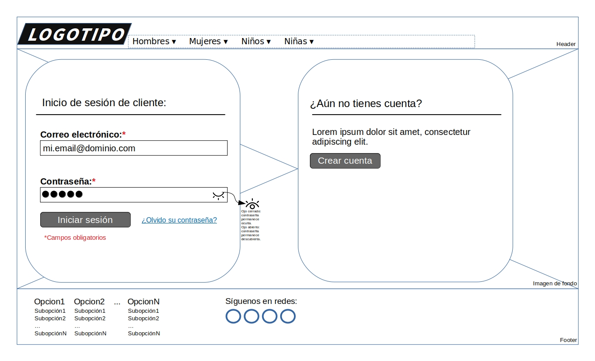
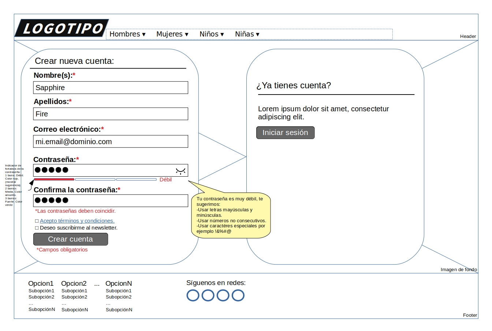
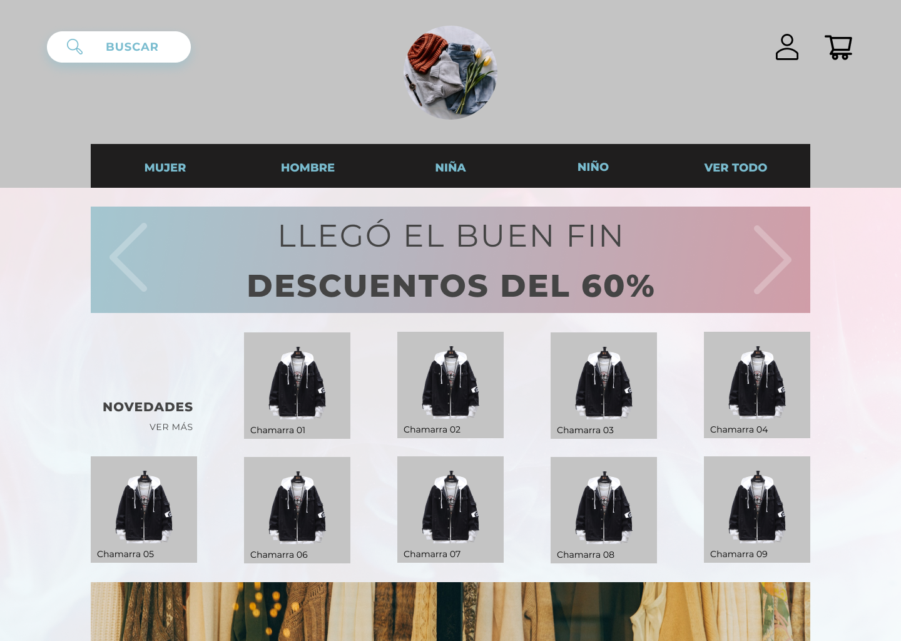
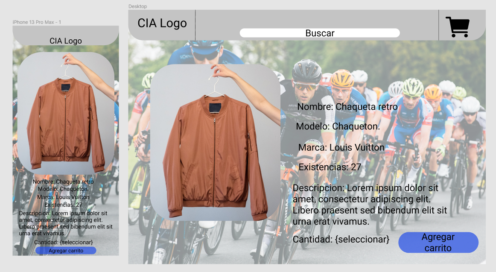
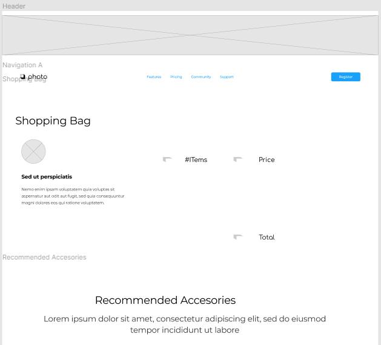

# grupo03_losRoperos

## Acerca de
Tienda en linea donde puedes comprar ropa para dama y caballero.

## Integrantes:

### Miguel Santamaria
Soy un estudiante de Ingeniería en Tecnologías computacionales con experiencia en diseño de algoritmos y desarrollo web. También tengo experiencia directa en gestión de proyectos y cuentas de grupos estudiantiles.

### Marco Antonio Garcia Santillan
Estudié Ing. Electrónica en el instituto tecnologico de Morelia, acobo de terminar mi maestría en ingenieria electrónica, ahora quiero incursionar en el campo de la programación como desarrollador Full stack, primeramente Dios.

### Javier Santoyo
Licenciado en tecnologías de Información con experiencia en bases de datos relacionales, administración de personal y procesos.

### Diego Salas
 Ingeniero Biomedico con dos años de experiencia y maestro de yoga creando un negocio en linea.

## Wireframes

### Registro

### Login

### Home

### Detalle de producto

### Shopping bag

#### Backup & Restore DB

Si creaste el diagrama y pasarlo a DB
https://www.youtube.com/watch?v=hfE0_Mme32k

Como crear Backup y Restore en BD de MySQL
https://www.youtube.com/watch?v=6kPIiY4La8Q
